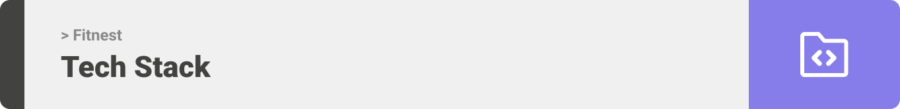

<div align="center">

> Hello world! This is the project’s summary that describes the project plain and simple, limited to the space available. 


**[PROJECT PHILOSOPHY](https://github.com/imtithalhalalo/fitnest#-project-philosophy) • [WIREFRAMES](https://github.com/imtithalhalalo/fitnest#-wireframes) • [TECH STACK](https://github.com/imtithalhalalo/fitnest#-tech-stack) • [IMPLEMENTATION](https://github.com/imtithalhalalo/fitnest#-impplementation) • [HOW TO RUN?](https://github.com/imtithalhalalo/fitnest#-how-to-run)**

</div>

<br><br>


> Fitnest app is a health tracker app where user's data will be collected and he/she will be connected to fitness trainers and chat with them, get notifications about his/her healthcare. A full vision of his progress using charts and graphs.
>
> There are workout programs you can start with detailed exercises. New healthy meals everyday, to save and eat during the day Breakfast, Lunch, Dinner.

### User Stories
- As a user, I want to view plans with workouts and exercises description and start them with timer.
- As a user, I want to have suggested healthy meals and be able to save them.
- As a user, I want to chat with fitness trainers about my health.
- As a user, I want to view graph about my weight, calories, water consumption.
- As a user, I want to receive notifications about my health progress.
### Trainer Stories
- As a trainer, I want to add new programs and plans to be followed by users.
- As a user,  I want to add new healthy meals with ingredients.
- As a user, I want to add exercises for each new workout.
- As a user, I want to chat with users about their health progress.

<br><br>


> This design was planned before on paper, then moved to Figma app for the fine details.

| Splash  | SignUp  | LogIn  | Landing  |
| -----------------| -----|-----|-----|
|  | 
 | |


<br><br>



Here's a brief high-level overview of the tech stack the Well app uses:

- This project uses the [React Native](https://reactnative.dev/). React Native a best-in-class JavaScript library for building user interfaces.
- For Database, the app uses the [MySQL](https://www.mysql.com/) which is a relational database management system based on the SQL.
- This project uses [Laravel](https://laravel.com/) which is a framework following MVC design pattern with elegant syntax. 
- For the chat, the application uses [Firebase](https://firebase.google.com/) which provides NoSQL and real-time hosting of databases. 
- For the messages, the application uses react-native-gifted-chat which is a great tool to implement chat.
- For maps, the application uses react-native-maps which provides a Map component that uses Apple Maps or Google Maps on iOS and Google Maps on Android.


<br><br>


> Using the above mentioned tech stacks and the wireframes build with figma from the user stories we have, the implementation of the app is shown as below, these are screenshots from the real app


<br><br>


> This is an example of how you may give instructions on setting up your project locally.
To get a local copy up and running follow these simple example steps.

### Prerequisites

This is an example of how to list things you need to use the software and how to install them.
* npm
  ```sh
  npm install npm@latest -g
  ```
* Download Expo Go

### Installation

_Below is an example of how you can instruct your audience on installing and setting up your app. This template doesn't rely on any external dependencies or services._

1. Clone the repo
   ```sh
   git clone https://github.com/imtithalhalalo/fitnest.git
   ```
2. Navigate to frontend-fitnest / Install NPM packages
   ```sh
   cd frontend-fitnest
   npm install
   ```
3. Run the start up command
   ```sh
   expo start
   ```
4. Scan the QR code above with Expo Go (Android) or the Camera app (iOS)

3. Navigate to backend-fitnest / Run the start up command
   ```sh
   cd fitnest-backend
   php artisan serve
   ```


